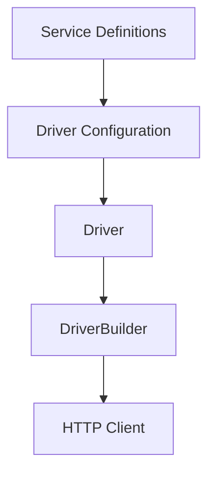

# HttpDriver


## Overview

HttpDriver is an advanced library designed to streamline API management by organizing interactions on a per-service basis. Leveraging both axios and fetch methods through the apisauce library, it delivers a robust, Promise-based HTTP client with enhanced error handling, asynchronous transformations, and interceptor support.

At its core, HttpDriver features:
- Dual HTTP method support (axios and fetch)
- Customizable request and response transformations (synchronous and asynchronous)
- Robust error handling with interceptors (including token refresh and request queuing)
- Standardized response formatting including execution duration, status, data, and error details

## Key Components

1. **Service**: An individual API endpoint definition. Services specify endpoints, HTTP methods, URL patterns with path parameters, and any needed payload structure. Grouping related endpoints into services improves maintainability and comprehension.
2. **Driver**: Serves as the central configuration hub. It sets up the base URL, manages the apisauce instance, and registers interceptors and transformation functions for both axios and fetch.
3. **DriverBuilder**: Implements the builder pattern to compile your configuration into a fully functional HTTP client. With DriverBuilder, you can tailor request/response transforms and interceptors, ensuring that your driver meets your specific requirements.

#### Key Components Diagram



## How HttpDriver Works

- **Initialization**: The Driver class creates an apisauce instance based on the provided configuration. It attaches both synchronous and asynchronous transforms and sets up error interceptors to manage token refresh and request queuing.
- **Service Execution**:
  - **execService**: Utilizes axios to resolve URLs, process payloads (with special support for multipart/form-data), and attach custom headers. It returns a standardized response featuring success status, HTTP status codes, data, error details, and timing information.
  - **execServiceByFetch**: Uses the Fetch API to construct requests, compute execution duration, and format responses consistently. It also supports custom request modification and transformation.
- Both methods share a common response format that simplifies error handling and integration within your application.

## Three-Step Process to Build a Driver

1. **Define Services**: Specify your API endpoints by detailing each service's identifier, URL (with support for templated parameters), and HTTP method.
2. **Register the Driver**: Combine your services with a base URL and configure any custom transformations or interceptors. This creates the driver configuration.
3. **Build with DriverBuilder**: Use DriverBuilder to compile the configuration into a Promise-based HTTP client. Customize it with axios-specific and fetch-specific options to suit your needs.

## Register and Build a Driver with Services

### Define Your Services

```typescript
import type { ServiceApi } from "@alvin0/http-driver/dist/utils/driver-contracts";

export default [
  {
    id: "login.auth",
    url: "login/auth",
    method: MethodAPI.post, // HTTP method
  },
  {
    id: "getUser",
    url: "getUser/{id}", // Templated URL for parameters
    method: MethodAPI.get,
  },
] as ServiceApi[];
```

### Register the Driver

```typescript
import type { DriverInformation, ServiceApi } from "@alvin0/http-driver/dist/utils/driver-contracts";
import AuthenticationServices from "./AuthenticationServices";

const baseURL: string = "http://localhost/api"; // Base URL for your API

export const services: ServiceApi[] = [
  ...AuthenticationServices,
  // additional services can be added here
];

const TestDriver: DriverInformation = {
  baseURL: baseURL,
  services: services,
};

export default TestDriver;
```

### Build the HTTP Client

```typescript
export const httpTestApi = new DriverBuilder()
  .withBaseURL(TestDriver.baseURL) // Set the base URL for all requests
  .withServices(TestDriver.services) // Register the defined services
  // Axios-specific: add custom request/response transformers and interceptors if needed
  .withAddRequestTransformAxios((req) => {
    // Customize Axios request here (e.g., add headers)
  })
  .withAddResponseTransformAxios((response) => {
    // Customize Axios response here
  })
  // Fetch-specific: add custom transformations if needed
  .addRequestTransformFetch((url, requestOptions) => ({ url, requestOptions }))
  .addTransformResponseFetch((response) => response)
  .build(); // Compile the driver into a functional HTTP client
```

## Calling APIs

HttpDriver provides two methods to execute API calls:

### Using Axios (execService)

```typescript
const res = await httpTestApi.execService(
  { id: "login.auth" },
  {
    username: "alvin0",
    password: "chaulamdinhai@gmail.com",
  }
);
```

### Using Fetch (execServiceByFetch)

```typescript
const res = await httpTestApi.execServiceByFetch(
  { id: "login.auth" },
  {
    username: "alvin0",
    password: "chaulamdinhai@gmail.com",
  }
);
```

## Additional Features

- **Dynamic URL Parameters**: Utilize templated URLs (e.g., `getUser/{id}`) to seamlessly incorporate path and query parameters.
- **Payload Conversion**: For GET requests, payloads automatically convert to query parameters.
- **Custom Error Handling**: Built-in interceptors manage errors, including token refresh and queuing of failed requests.
- **Performance Metrics**: Both axios and fetch calls are measured for execution duration, streamlining performance analysis.

## SWR Integration Example

Integrate HttpDriver with SWR for efficient data fetching:

```typescript
import useSWR, { SWRConfiguration } from "swr";

interface Optional {
  requestOptions?: { [key: string]: any };
  swrOptions?: SWRConfiguration;
}

interface IPropHttpDriverSwr {
  keySwr: string;
  idService: ServiceUrlCompile;
  payload?: any;
  optional?: Optional;
}

export default function useDriverSwrAxios({
  keySwr,
  idService,
  payload,
  optional,
}: IPropHttpDriverSwr) {
  const axios = async () =>
    httpTestApi.execService(idService, payload, optional?.requestOptions);
  const swr = useSWR(keySwr, axios, optional?.swrOptions);
  return { ...swr };
}
```

## Examples

Below are additional examples to illustrate common usage scenarios:

### Example 1: Basic API Call Using Axios (execService)

This example demonstrates how to call a login API:

```typescript
const res = await httpTestApi.execService(
  { id: "login.auth" },
  {
    username: "alvin0",
    password: "your_password",
  }
);

if (res.ok) {
  console.log("Login successful:", res.data);
} else {
  console.error("Login failed:", res.problem);
}
```

### Example 2: Fetching User Details with Dynamic URL Parameters

For endpoints with templated URLs, such as fetching user details:

```typescript
const userId = "123";
const res = await httpTestApi.execServiceByFetch({
  id: "getUser",
  params: { id: userId, extra: "detail" }
});

if (res.ok) {
  console.log("User details:", res.data);
} else {
  console.error("Error fetching user:", res.problem);
}
```

### Example 3: Using SWR for Data Fetching


Combine HttpDriver with SWR for efficient, real-time data retrieval:

```typescript
import useDriverSwrAxios from './useDriverSwrAxios';

function UserComponent({ userId }: { userId: string }) {
  const { data, error, isLoading } = useDriverSwrAxios({
    keySwr: `user-${userId}`,
    idService: { id: "getUser", params: { id: userId } },
    payload: {},
    optional: {
      swrOptions: {
        dedupingInterval: 600000, // 10 minutes
        revalidateOnFocus: false,
      }
    }
  });

  if (isLoading) return <p>Loading...</p>;
  if (error) return <p>Error loading user data</p>;
  return <div>{JSON.stringify(data)}</div>;
}
```

### Example 4: Multiple Drivers Example

One of the strengths of HttpDriver is the ability to configure and support multiple drivers for different APIs. For instance, consider the JSONPlaceholder driver which handles various endpoints for posts:

```typescript
import { httpJsonPlaceholderDriver } from "./api-clients";
import { JsonPlaceholderPostServiceIds } from "./api-clients/jsonplaceholder-driver/post-services";

const fetchListPost = async () => {
  const response = await httpJsonPlaceholderDriver.execService({
    id: JsonPlaceholderPostServiceIds.List,
  });
  if (response.status === 200) {
    console.log("Post List:", response.data);
    return response.data;
  } else {
    console.error("Failed to fetch post list:", response.problem);
  }
};

const fetchPostDetail = async (id: number) => {
  const response = await httpJsonPlaceholderDriver.execService({
    id: JsonPlaceholderPostServiceIds.Detail,
    params: { id },
  });
  if (response.status === 200) {
    console.log("Post Detail:", response.data);
    return response.data;
  } else {
    console.error("Failed to fetch post detail:", response.problem);
  }
};
```

## Testing

### Running Tests Locally

```bash
# Run tests with coverage
npm test

# Run tests without coverage
npm test -- --no-coverage
```

Current test coverage:
- Statements: 90.62%
- Branches: 73.17%
- Functions: 90.62%
- Lines: 90.17%

The test suite includes:
- Unit tests for core functionality
- Error handling scenarios
- Network request mocking
- Edge cases and error conditions

### Running GitHub Actions Locally

To test the GitHub Actions workflow locally, you can use [act](https://github.com/nektos/act):

1. Install act:
```bash
# For Windows (requires Docker)
choco install act-cli
```

2. Run the workflow:
```bash
act -j test
```

This will execute the same test workflow that runs in GitHub Actions.

## Author

Châu Lâm Đình Ái (alvin0)  
GitHub: https://github.com/alvin0  
Email: chaulamdinhai@gmail.com
