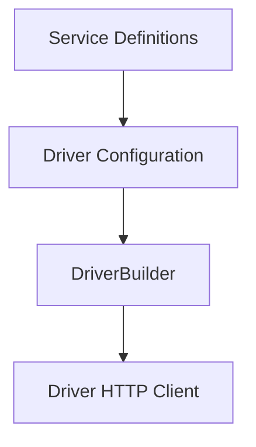

# HttpDriver


Modern, typed per-service HTTP client for Axios and Fetch (no apisauce). Standardized responses, transform hooks, interceptor support, and AbortController handling across both paths.

## Features

- **Dual HTTP paths**: Axios via execService, Fetch via execServiceByFetch
- **Flexible Version Management**: Dynamic version injection with multiple positioning strategies
- **Standard ResponseFormat** shape with ok, status, data, headers, duration, problem, originalError
- **Builder pattern** with full set of hooks (Axios sync/async transforms, error interceptor; Fetch request/response transforms)
- **URL template compilation** and query assembly with version support
- **JSON and multipart/form-data** payload shaping (Fetch drops manual Content-Type for multipart)
- **AbortController support** on both paths (Axios cancellation normalized to TimeoutError)

## Overview

HttpDriver is an advanced library designed to streamline API management by organizing interactions on a per-service basis. Leveraging both Axios and the Fetch API, it delivers a robust, Promise-based HTTP client with enhanced error handling, asynchronous transformations, and interceptor support.

At its core, HttpDriver features:
- Dual HTTP method support (Axios and Fetch)
- Customizable request and response transformations (synchronous and asynchronous)
- Robust error handling with interceptors (including token refresh and request queuing)
- Standardized response formatting including execution duration, status, data, and error details

## Key Components

1. Service: An individual API endpoint definition. Services specify endpoints, HTTP methods, URL patterns with path parameters, and optional default options. Grouping related endpoints into services improves maintainability and comprehension.
2. Driver: Central runtime that binds the baseURL and services, exposes execution methods, wires Axios request/response transforms and interceptors, and provides Fetch request/response transform hooks.
3. DriverBuilder: Builder pattern to configure and compile your driver with all hooks in a fluent, type-safe manner.

#### Key Components Diagram



## How HttpDriver Works

- Initialization: The Driver constructs an Axios instance based on your configuration, attaches synchronous and asynchronous transforms, and sets up error interceptors for token refresh patterns. For Fetch, request and response transform hooks are available.
- Service Execution:
  - execService: Uses Axios to call compiled URLs, handle payloads (including multipart/form-data with FormData), and pass custom headers. Returns a standardized response with ok, status, data, headers, problem, originalError, and duration.
  - execServiceByFetch: Uses the Fetch API to invoke compiled URLs, measure duration precisely, parse responses (strict JSON by default), and apply optional request/response transforms.
- Both methods share the same standardized response shape, simplifying error handling and integration in your app.

## Three-Step Process to Build a Driver

1. Define Services: Specify your API endpoints (id, templated URL, method).
2. Register Driver: Provide baseURL and services, optionally configuring transforms and interceptors.
3. Build with DriverBuilder: Compile into a Promise-based client and use execService / execServiceByFetch across your app.

## Install

npm install @alvin0/http-driver

## Quick start

1) Define services

```ts
import { MethodAPI, type ServiceApi } from "@alvin0/http-driver/dist/utils/driver-contracts";

const services: ServiceApi[] = [
  { id: "posts.list", url: "posts", method: MethodAPI.get },
  { id: "posts.detail", url: "posts/{id}", method: MethodAPI.get },
  { id: "auth.login", url: "login/auth", method: MethodAPI.post },
];
```

2) Build a driver

```ts
import { DriverBuilder } from "@alvin0/http-driver";
import type { ResponseFormat } from "@alvin0/http-driver/dist/utils/driver-contracts";

const httpApi = new DriverBuilder()
  .withBaseURL("https://jsonplaceholder.typicode.com")
  .withServices(services)
  // Axios sync transform
  .withAddRequestTransformAxios((req) => {
    req.headers = { ...(req.headers || {}), "X-App": "demo" };
  })
  // Axios async transforms
  .withAddAsyncRequestTransformAxios((register) => {
    register(async (req) => {
      req.headers = { ...(req.headers || {}), "X-Async-Req": "1" };
    });
  })
  .withAddResponseTransformAxios((_resp) => {
    // inspect normalized ApiResponse-like
  })
  .withAddAsyncResponseTransformAxios((register) => {
    register(async (_res) => {
      // async work
    });
  })
  // Axios error interceptor (optional)
  .withHandleInterceptorErrorAxios((axiosInstance) => async (error) => {
    // e.g., retry once on 401
    if (error?.response?.status === 401 && !error?.config?._retry) {
      error.config._retry = true;
      return axiosInstance.request(error.config);
    }
    return Promise.reject(error);
  })
  // Fetch transforms
  .withAddRequestTransformFetch((url, requestOptions) => {
    const u = new URL(url);
    u.searchParams.set("via", "fetch-transform");
    return {
      url: u.toString(),
      requestOptions: {
        ...requestOptions,
        headers: { ...(requestOptions.headers || {}), "X-Fetch": "1" },
      },
    };
  })
  .withAddTransformResponseFetch((response: ResponseFormat) => {
    return { ...response, data: { wrapped: true, original: response.data } } as ResponseFormat;
  })
  .build();
```

3) Make requests

```ts
// Axios path
const list = await httpApi.execService({ id: "posts.list" });
// Fetch path
const listByFetch = await httpApi.execServiceByFetch({ id: "posts.list" });
```

## Version Configuration

HttpDriver provides flexible version management for API services. Instead of hardcoding versions into baseURL, you can configure version handling in multiple ways.

### Why Version Configuration?

**Before:**
- Hardcode version in baseURL: `https://api.example.com/v1`
- Difficult to change versions per service
- Inflexible when API provider changes version patterns

**After:**
- Clean baseURL: `https://api.example.com`
- Automatic version injection with flexible positioning
- Service-level version overrides
- Support for multiple version patterns

### Basic Usage

```ts
// Simple global version
const driver = new DriverBuilder()
  .withBaseURL("https://api.example.com")  // No hardcoded version
  .withServices(services)
  .withGlobalVersion(1)  // Global version for all services
  .build();

// Result: https://api.example.com/v1/users
```

### Service-specific Version Override

```ts
const services: ServiceApi[] = [
  {
    id: "user.list",
    url: "users",
    method: MethodAPI.get,
    // Uses global version
  },
  {
    id: "user.detail", 
    url: "users/{id}",
    method: MethodAPI.get,
    version: 2, // Override global version
  },
];

const driver = new DriverBuilder()
  .withBaseURL("https://api.example.com")
  .withServices(services)
  .withGlobalVersion(1)
  .build();

// user.list: https://api.example.com/v1/users
// user.detail: https://api.example.com/v2/users/123
```

### Version Positioning Strategies

#### After Base URL (Default)
```ts
.withVersionConfig({
  position: 'after-base',
  defaultVersion: 1
})
// Result: https://api.example.com/v1/users
```

#### Before Endpoint
```ts
.withVersionConfig({
  position: 'before-endpoint',
  defaultVersion: 1
})
// Result: https://api.example.com/users/v1
```

#### Subdomain Versioning
```ts
.withVersionConfig({
  position: 'prefix',
  defaultVersion: 1
})
// Result: https://v1.api.example.com/users
```

#### Custom Template
```ts
.withVersionConfig({
  position: 'custom',
  template: '{baseURL}/api/{version}/{endpoint}',
  defaultVersion: 1
})
// Result: https://api.example.com/api/v1/users
```

### Advanced Configuration

```ts
// Enterprise API with custom pattern
const driver = new DriverBuilder()
  .withBaseURL("https://api.company.com")
  .withVersionConfig({
    position: 'custom',
    template: '{baseURL}/rest/api/{version}/services/{endpoint}',
    prefix: 'api-v',  // Custom prefix instead of 'v'
    defaultVersion: '2024.1'
  })
  .withServices(services)
  .build();

// Result: https://api.company.com/rest/api/api-v2024.1/services/users
```

### Version Configuration Options

```ts
interface VersionConfig {
  position?: 'after-base' | 'before-endpoint' | 'prefix' | 'custom';
  template?: string;  // For custom position: '{baseURL}/api/{version}/{endpoint}'
  prefix?: string;    // Default: 'v', set to '' for no prefix
  defaultVersion?: string | number;  // Global default version
}
```

### Builder Methods

```ts
// Set complete version configuration
.withVersionConfig(config: VersionConfig)

// Quick set global version only  
.withGlobalVersion(version: string | number)
```

For detailed examples and migration guide, see [Version Configuration Documentation](docs/version-configuration.md).

## Service ID convention (enum recommended)

For maintainability and strong typing, define service IDs as an enum. We recommend a namespaced pattern:
v{version}.{domain}.{resource}.{action}

Benefits:
- Type-safe IDs with auto-complete
- Consistent naming across your codebase
- Easier refactors and usage in call sites

Example:

```ts
import {
  MethodAPI,
  type ServiceApi,
} from "@alvin0/http-driver/dist/utils/driver-contracts";

export enum ExampleServiceIds {
  List = "v1.example.games.list",
  ListCouponAvailable = "v1.example.games.coupon-available",
  ListMerchantAvailable = "v1.example.games.merchant-available",
  DownloadCSV = "v1.example.games.download-csv",
  Store = "v1.example.games.store",
  Detail = "v1.example.games.detail",
  Update = "v1.example.games.update",
  Destroy = "v1.example.games.destroy",
  Restore = "v1.example.games.restore",
}

export default [
  {
    id: ExampleServiceIds.List,
    url: "v1/admin/games",
    method: MethodAPI.get,
    version: 1,
  },
  {
    id: ExampleServiceIds.ListCouponAvailable,
    url: "v1/admin/games/coupon-available",
    method: MethodAPI.get,
    version: 1,
  },
  {
    id: ExampleServiceIds.ListMerchantAvailable,
    url: "v1/admin/games/merchant-available",
    method: MethodAPI.get,
    version: 1,
  },
  {
    id: ExampleServiceIds.DownloadCSV,
    url: "v1/admin/games/csv",
    method: MethodAPI.get,
    version: 1,
  },
  {
    id: ExampleServiceIds.Store,
    url: "v1/admin/games",
    method: MethodAPI.post,
    version: 1,
  },
  {
    id: ExampleServiceIds.Detail,
    url: "v1/admin/games/{id}",
    method: MethodAPI.get,
    version: 1,
  },
  {
    id: ExampleServiceIds.Update,
    url: "v1/admin/games/{id}",
    method: MethodAPI.put,
    version: 1,
  },
  {
    id: ExampleServiceIds.Destroy,
    url: "v1/admin/games/{id}",
    method: MethodAPI.delete,
    version: 1,
  },
  {
    id: ExampleServiceIds.Restore,
    url: "v1/admin/games/{id}/restore",
    method: MethodAPI.patch,
    version: 1,
  },
] as ServiceApi[];
```

Usage:

```ts
// Axios path
const detail = await httpApi.execService({
  id: ExampleServiceIds.Detail,
  params: { id: 123 },
});

// Fetch path
const list = await httpApi.execServiceByFetch({ id: ExampleServiceIds.List });
```

## AbortController

Axios path (cancel maps to TimeoutError):
```ts
const c = new AbortController();
const p = httpApi.execService({ id: "posts.list" }, undefined, { signal: c.signal });
c.abort();
const res = await p; // res.ok === false, problem ~ 'timeout'
```

Fetch path:
```ts
const c = new AbortController();
const p = httpApi.execServiceByFetch({ id: "posts.list" }, undefined, { signal: c.signal });
c.abort();
const res = await p; // res.ok === false, problem ~ 'timeout'
```

You may also pass { abortController } and the library will forward .signal.

## getInfoURL

Compile a full URL and see how GET payloads become query strings:
```ts
const info = httpApi.getInfoURL({ id: "posts.detail", params: { id: 1 } }, { q: "abc", page: 2 });
// info.fullUrl -> https://jsonplaceholder.typicode.com/posts/1?q=abc&page=2
```

## Standalone httpClientFetch

```ts
import { httpClientFetch } from "@alvin0/http-driver/dist/utils";
import { MethodAPI } from "@alvin0/http-driver/dist/utils/driver-contracts";

const res = await httpClientFetch({ url: "https://example.com/posts/{id}", method: MethodAPI.get, param: { id: "1" } });
```

## Response shape

Every call returns:
```ts
interface ResponseFormat<T = any> {
  ok: boolean;
  problem: string | null;
  originalError: string | null;
  data: T;
  status: number;
  headers?: Headers | null;
  duration: number;
}
```

Error normalization includes TimeoutError, NetworkError, MalformedResponseError; fetch JSON parsing is strict by default.

## Multipart (Fetch)

When headers["Content-Type"] === "multipart/form-data", the library removes explicit headers so the browser can set the boundary. Body is built from your payload FormData automatically.

## Multiple drivers

```ts
import postsServices from "./posts-services";
import adminServices from "./admin-services";

const postsDriver = new DriverBuilder().withBaseURL("https://api.example.com").withServices(postsServices).build();
const adminDriver = new DriverBuilder().withBaseURL("https://admin.example.com").withServices(adminServices).build();
```

## SWR example (Axios)

```ts
import useSWR from "swr";

export function usePosts() {
  const fetcher = () => httpApi.execService({ id: "posts.list" });
  return useSWR("posts", fetcher);
}
```

## Examples

The repository includes runnable examples:
- **Basic JSONPlaceholder and DummyJSON flows**
- **Version Configuration examples** - Various versioning strategies
- **Advanced samples** (AbortController, transforms, httpClientFetch)
- **Full Builder demo** (all hooks)

Run:

```bash
npm run start:example
```

Entry point: `example/index.ts`

## API reference (selected)

- DriverBuilder
  - withBaseURL(baseURL: string)
  - withServices(services: ServiceApi[])
  - withGlobalVersion(version: string | number)
  - withVersionConfig(config: VersionConfig)
  - withAddRequestTransformAxios(fn)
  - withAddResponseTransformAxios(fn)
  - withAddAsyncRequestTransformAxios(registrar)
  - withAddAsyncResponseTransformAxios(registrar)
  - withHandleInterceptorErrorAxios(fn)
  - withAddRequestTransformFetch(fn)
  - withAddTransformResponseFetch(fn)
- Driver instance
  - execService({ id, params? }, payload?, options?)
  - execServiceByFetch({ id, params? }, payload?, options?)
  - getInfoURL({ id, params? }, payload?)

For implementation details, see source comments.

## License

MIT


## Author

Châu Lâm Đình Ái (alvin0)  
GitHub: https://github.com/alvin0  
Email: chaulamdinhai@gmail.com
